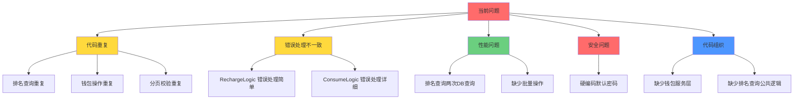

# 用户微服务代码优化方案

## 优化概览图



## 详细优化建议

### 1. 抽取钱包服务层（WalletService）

**问题**：充值、消费、退款逻辑重复，维护困难

**方案**：创建统一的钱包服务层

```go
// internal/service/walletservice.go
type WalletService struct {
    db *gorm.DB
    logger logx.Logger
}

// 统一的钱包操作接口
func (s *WalletService) UpdateBalance(ctx context.Context, req *WalletUpdateRequest) error
```

**收益**：
- 减少代码重复
- 统一错误处理
- 便于测试和维护

### 2. 抽取排名查询公共逻辑

**问题**：两个排名查询逻辑几乎完全相同

**方案**：抽取公共方法

```go
// internal/logic/ranking_helper.go
func queryRankingWithProfiles(
    ctx context.Context,
    db *gorm.DB,
    redis *redis.Redis,
    key string,
    page, pageSize int,
    scoreConverter func(score int64) float64,
) ([]*user.CompanionRankingItem, int32, error)
```

**收益**：
- 减少代码重复
- 统一查询逻辑
- 便于扩展新的排名类型

### 3. 优化排名查询性能

**问题**：两次独立数据库查询（users 和 profiles）

**方案**：使用 JOIN 查询

```go
// 优化前：两次查询
db.Where("id IN ?", userIDs).Find(&users)
db.Where("user_id IN ?", userIDs).Find(&profiles)

// 优化后：一次 JOIN 查询
db.Table("users").
    Select("users.*, companion_profiles.*").
    Joins("LEFT JOIN companion_profiles ON users.id = companion_profiles.user_id").
    Where("users.id IN ?", userIDs).
    Scan(&results)
```

**收益**：
- 减少数据库往返次数
- 提升查询性能
- 降低数据库负载

### 4. 统一错误处理

**问题**：不同 Logic 错误处理方式不一致

**方案**：创建统一的错误处理工具

```go
// internal/logic/errors.go
func HandleDBError(err error, logger logx.Logger, operation string) error {
    if errors.Is(err, gorm.ErrRecordNotFound) {
        return status.Error(codes.NotFound, operation+" not found")
    }
    logger.Errorf("%s failed: %v", operation, err)
    return status.Error(codes.Internal, operation+" failed")
}
```

### 5. 修复安全问题

**问题**：`hashPassword` 函数有硬编码默认密码

**方案**：移除默认密码逻辑

```go
// 优化前
func hashPassword(password string) (string, error) {
    if password == "" {
        password = "123456"  // ❌ 安全问题
    }
    // ...
}

// 优化后
func hashPassword(password string) (string, error) {
    if password == "" {
        return "", errors.New("password cannot be empty")  // ✅ 拒绝空密码
    }
    // ...
}
```

### 6. 统一分页参数校验

**问题**：分页参数校验逻辑重复

**方案**：抽取公共函数

```go
// internal/logic/pagination.go
type PaginationParams struct {
    Page     int
    PageSize int
}

func NormalizePagination(page, pageSize int32) PaginationParams {
    p := int(page)
    if p < 1 {
        p = 1
    }
    ps := int(pageSize)
    if ps < 1 {
        ps = 10
    }
    if ps > 100 {
        ps = 100
    }
    return PaginationParams{Page: p, PageSize: ps}
}
```

## 优化优先级

1. **高优先级**（立即修复）
   - 安全问题：移除硬编码默认密码
   - 性能问题：优化排名查询为 JOIN

2. **中优先级**（近期优化）
   - 抽取钱包服务层
   - 统一错误处理
   - 抽取排名查询公共逻辑

3. **低优先级**（长期优化）
   - 统一分页参数校验
   - 添加单元测试
   - 添加性能监控

## 实施步骤

1. 修复安全问题（1小时）
2. 优化排名查询性能（2小时）
3. 抽取钱包服务层（4小时）
4. 统一错误处理（2小时）
5. 抽取排名查询公共逻辑（2小时）
6. 统一分页参数校验（1小时）

**总预计时间**：12小时
